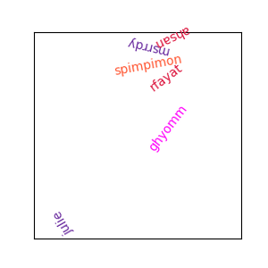

# Introduction to git and github
Introduction to git/github for the team members.

**N.B.** The concepts presented here also apply to other online code version control system such as [gitlab](https://about.gitlab.com/). We will only cover basic functionalities of these tools that are of particular interest in research, although many more advanced functionalities exist.

If you haven't already, [create a github account](https://github.com/join). I recommend you to use a personal email address that will still work after you leave the lab. If you are on windows or macOS please also [install github Desktop](https://desktop.github.com/).

Note that as students, you are eligible to a [pro account for free](https://education.github.com/benefits/offers).

## A quick introduction to git and github main concepts

### Why and how to use github - Solo mode

#### Github as a versioning, file navigation and code sharing tool

- Tired of having multiple versions of your code ?
- Ever had trouble working from several computers on the same code (e.g. experimental setup) ?
- Are all of your analysis done in huge notebooks / scripts that are unreadable ?
- Did you ever want to find the old version of the code you since modified ?
- Do you keep huge commented pieces of old code in your scripts "just in case" ?
- Ever had trouble reproducing an analysis you did a few months back ?
- Have you ever wished the you from the past explained to you what a bit of code or analysis did or how to get it to work ?
- Ever been in a situation where you need to find the perfect function you wrote six months ago ?
- Ever wanted a better way to navigate through your code and results of analysis from anywhere ?
- Don't you think it would be a good thing if other PhD students could use your analysis and if you could use theirs ?

Then use git (code versioning) and github/gitlab (online code storage and navigation) !

#### Terminology

- **Repository** - A folder containing your project's file and each file revision history.
- **Fork** - Your own copy of an existing repository.
- **Clone** - Download an online repository to your computer.
- **Commit** - A set a file modifications along with a brief explanation of what you did.
- **Push** - Sending your local commit(s) to the online repository.
- **Pull** - Grabbing the latest commit(s) from an online repository.

#### Workflow for working with github alone

I create a new or **fork** an existing **repository**.

I **clone** the repository on my local computer.

I make changes (file addition/deletion/modification) on my *local copy* of the repository and briefly describe what I did in one or multiple **commits** using git.

I can now **push** my changes to the online github repository.

If commits were made on the repository by someone else or from another computer, I can **pull** them to include the modifications to my local copy of the repository.

#### Overview of the content of a typical repository

- README.md
- Complete instructions and required files for running the code
- .gitignore
- Code
- ...

### Why and how - Collab mode

#### Github as a collaboration tool
Git and github/gitlab are also great for code collaboration, whether it is for a small project ~~like spending 3 months working on a video acquisition software that did not really work in the end with [@stebett](https://github.com/stebett)~~ or allowing you to contribute to tools used by the community.

#### Terminology

- **branch** - An alternative version of the code which you can modify without affecting the original one
- **pull request** - Discussion about modifications you made in a branch before including them in another branch
- **merge** - Include the changes made in a branch of the code to another branch (usually the main one)


#### Workflow for collaborating on github


## Mini example
### Goal

A [csv file](team_members.csv) containing the team pseudos is available along with corresponding [hex colors](https://g.co/kgs/QYgAHH). This table is loaded by a [python script](python_example/draw_names.py) which saves the following picture in the [output](output) folder:



### Tasks

#### Github - Solo mode

- Create your own **[fork](https://docs.github.com/en/get-started/quickstart/fork-a-repo)** of the repository from github interface
- **[Download / Clone](https://docs.github.com/en/repositories/creating-and-managing-repositories/cloning-a-repository)** your **fork** of the repository from github interface
- Add your name to the csv file (e.g. using excel)
- Re-run the python script to update the figure with your name
- **Commit** your changes on your computer
- **Push** your commit to your online **fork**

#### Github - Collab mode

- Create your own **[fork](https://docs.github.com/en/get-started/quickstart/fork-a-repo)** of the repository from github interface
- Create a new **[branch](https://docs.github.com/en/pull-requests/collaborating-with-pull-requests/proposing-changes-to-your-work-with-pull-requests/creating-and-deleting-branches-within-your-repository#creating-a-branch)** in your fork of the repository
- **[Download / Clone](https://docs.github.com/en/repositories/creating-and-managing-repositories/cloning-a-repository)** your **fork** of the repository from github interface
- **Change branch** to your newly created **branch** on your local copy of your **fork**
- Add your name to the csv file (e.g. using excel)
- Re-run the python script to update the figure with your name
- **Commit** your changes on your computer
- **Push** your commit to your **branch** of your **fork**
- Open a **[pull request](https://docs.github.com/en/pull-requests/collaborating-with-pull-requests/proposing-changes-to-your-work-with-pull-requests/creating-a-pull-request)** to the original repository so that your **commit** can be **merged**


### Installation and running the script
**TODO** : Python install if needed

After cloning the repository, change directory to the repository folder and install the requirements as follows:

```bash
$ cd github_intro
$ pip install -r requirements.txt
```

Then the python script can be run as follows:
```bash
$ python -m python_example.draw_names
```
